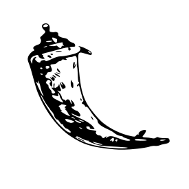

<h1 align="center"> Hey there! I'm Soyuj Jung Basnet. 👨‍💻</h1>

<h3 align="center">An Impassioned Deep Learning & Machine Learning Practitioner and Learner from Nepal.</h3>

&nbsp;&nbsp;&nbsp;&nbsp;&nbsp;&nbsp;&nbsp;&nbsp;

- 🔭 I’m currently working on a project to aid blind/low vision people using computer vision as a member of the <a href="http://www.incubate-nepal.com/" target="_blank">Incubate Nepal</a> program.
- 💼 I’m also currently working as a Python Developer and a Senior Python and JavaScript Content Editor at <a href="https://www.programiz.com/" target="_blank">Programiz</a>.
- 🌱 I'm fascinated by Mathematics, Computer Science, and Physics. Visit <a href="https://github.com/basnetsoyuj/learning" target="_blank">My Learning Path</a> to learn more about how I intend to get better at my craft.
- 👯 I am always open to discussing new projects, creative ideas, and opportunities.
- ⚡ Fun fact: While waiting for neural networks to train, I love to indulge myself in chess ♟️. Feel free to leave me a challenge on <a href="https://lichess.org/@/basnetsoyuj" target="_blank">Lichess</a>.
- 📝 I have recently developed a keen interest in penning down my thoughts, musings, and experiences as blog posts.

<h3>✍️ Featured Blog Posts:</h3>
<ul>
<li><a href="https://soyuj.com.np/blog/mastering-bagh-chal-with-self-learning-ai">Mastering the Nepali Board Game of Bagh Chal with self-learning AI</a></li>
<li><a href="https://soyuj.com.np/blog/content-workflow-system">Developing The Content Workflow System for Programiz</a></li>
</ul>

Visit <a href="https://soyuj.com.np/blog">soyuj.com.np/blog</a> to checkout all of my writings.

  

<h5 align="center">Language & Tools:</h5>

                     

